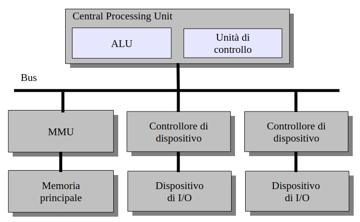

# Introduzione ai Sistemi Operativi

Un **Sistema operativo** è livello di astrazione:
- Realizza il concetto di processo
- Il "linguaggio" fornito dal SO è definito dalle system call
- Implementato tramite un programma che **controlla l'esecuzione di programmi applicativi** e agisce come **interfaccia tra le applicazioni e l'hardware** del calcolatore

Gli **obbiettivi** sono ottenere *Efficienza* e *Semplicità*

Un sistema operativo nasconde i dettagli dell'hardware ai programmatori tramite una API che agisce come intermediario.

Servizi estesi offerti da un SO (classi di System Call):
- Esecuzione dei programmi
- Accesso ai dispositivi I/O
- Accesso a File System
- Accesso a networking
- Accesso al sistema
- Rilevazione e risposta agli errori
- Accounting (Come gestione di timer, utilizzo di memoria, ecc)

## Storia dei Sistemi Operativi

- **Generazione 1**: 1945 - 1955
	- Valvole e tavole di commutazione
- **Generazione 2**: 1955 - 1965
	- Transistor e Sistemi Batch
- **Generazione 3**: 1965 - 1980
	- Circuiti integrati, multiprogrammazione e time-sharing
- **Generazione 4**: 1980 - oggi
	- Personal Computer

### Generazione 0
**Babbage (1792-1871)**
- Macchina programmabile e meccanica
- Niente SO

### Generazione 1
- Macchine a valvole e tavole di commutazione
- Solo calcoli numerici, gruppi di persone per singolo computer
- Venivano programmati direttamente in linguaggio macchina
- Ovviamente nessun SO

Problemi:
- Guasti frequenti
- Utilizzazione lenta e complessa

### Generazione 2
- Iniziano ad essere usati i transistor
- Più economici e più affidabili
- Iniziano quindi ad avere mercato e ad affermarsi
- Programmazione in Assembly e Fortran, tramite schede perforate
- Sistema operativo "batch"

Definizione: **JOB**
- Un programma o un insieme di essi la cui esecuzione veniva richiesta da uno degli utenti del computer

Ciclo di esecuzione di un job:
- Il programmatore scrive il programma su carta, perfora le schede e consegna le schede all'operatore
- L'operatore inserisce le schede di controllo, poi quelle del programma, attente il risultato e lo consegna al progammatore

Primi rudimentali esempi di SO, detti anche *monitor residenti*
- Controllo iniziale del monitor
- Controllo ceduto al job corrente
- Terminato, il job resituisce il controllo al monitor

**Sistema batch** = "infornata"

Problemi:
- Molte risorse inutilizziate, il passaggio da un job ad un altro rende parte del processore inutlizzato
- Primo miglioramento caricando i job su un nastro (off-line), elaborazione con output sul nastro ed infine stampa sul nastro di output (off-line)

### Generazione 3
Utilizzo di circuiti integrati, ci si sposta ad un utente come operatore

Venivano programmati in C, si usavano editor testuali, compilatori. Si aveva accesso al sistema da terminali

Sistemi operativi **interattivi**, **multi-programmazione** e **time sharing**

- **Multi-programmazione**
	- Utilizzare il processo durante i periodi di I/O di un job per eseguire altri job
	- Il vantaggio è lo sfruttamento totale del processore in caso di operazioni I/O lunghe, oltre all'utilizzo migliore di memoria
	- Caratteristiche dei SO multiprogrammati
		- Le routine di I/O devono essere fornite dal SO
		- Gestione della memoria come stack
		- CPU scheduling, il SO sceglie quale job eseguire
		- Allocazione delle risorse di I/O
- **Time sharing**
	- Estensione logica della multi-programmazione
	- Esecuzione della CPU divisa in $n$ *quanti* temporali
	- Allo scadere di un *quanto*, si passa ad un altro job (anche in assenza di richieste di I/O
	- I passaggi (*context switch*) avvengono così frequentemente che più utenti possono interagire con i programmi in esecuzione
	- Caratteristiche dei SO time sharing
		- Gestione della memoria come memoria virtuale
		- CPU scheduling di tipo *preemptive* e *time-sliced*
		- Meccanismi di protezione per utilizzo multi utente

Unix era la riscrittura in C dei SO scritti in Assembly

### Generazione 4
Personal computer dedicati ai singoli utenti, con l'obbiettivo primario della facilità d'uso

Sottovalutazione della sicurezza, solo dopo i SO dei PC furono resi sicuri

## Sistemi paralleli
Un singolo elaboratore che possiede più unità di elaborazione

Due tipi: **SIMD** (Single Instruction, Multiple Data) e **MIMD** (Multiple Instruction, Multiple Data)

- Sistemi **tightly** coupled
	- Bus / Memoria condivisa
	- Pochi processi / Basso livello di parallelismo. Bus = bottleneck
- Sistemi **loosely** coupled
	- Processori con memoria privata interconnessi da canali
	- Tanto processori, alto livello di parallelismo

- Symmetric multiprocessing (SMP)
	- Ogni processore esegue una copia identica del SO
	- Processi diversi eseguibili contemporaneamente
	- Molti SO supportano SMP
- Asymmetric multiprocessing
	- Ogni processore è assegnato ad un compito specifico, un processore master gestisce l'allocazione
	- Comune in sistemi molto grandi

## Sistemi distribuiti
Sistemi composti da più elaboratori indipendenti. Esempio: Macchine di laboratorio

- Condivisione di file
- Possibilità di comunicare
- Ogni computer opera in modo indipendente
- Minore utonomia tra computer
- Dà l'impressione che un singolo SO stia controllando tutti gli elaboratoridi sistema distribuito

## Sistemi real-time
Sistemi per cui la correttezza del risultato dipende anche dall'istante nel quale il risultato viene prodoto

I sistemi real-time si dividono in:
- hard real-time
	- Se il mancato rispetto dei vincoli temporali può avere effetti catastrofici
- soft real-time
	- Se si hanno solamente disagi o disservizi

NB: real-time non significa necessariamente esecuzione veloce

# Modulo HW: richiami architetturali
## Architettura di Von Neumann

- Device -> Fatto di ferro
- Device Controller -> Hardware (silicio)
- Device Driver -> Software

- Memory Managment Unit -> Silicio
- Memory Manager -> Software

## Interrupt
Un meccanismo che permette l'interruzione del normale ciclo di esecuzione della CPU
- Permettono al SO di "intervenire" durante l'esecuzione di un programma
- Sia hardware che software
- Ci sono $n$ bit, uno per "filo" di interrupt, serve per non fare interrompere l'esecuzione alla CPU.
	- Questi bit sono nei registri della CPU 

### Trap
- **Interrupt Hardware**
	- Sono *asincroni*, come dispositivi di I/O, interval timer
	- Generati dai contoller stessi
- **Interrupt Software (Trap)**
	- Causato dal programma, come divisione per 0, system call

Gli interrupt sono segnali inviati **AL** processore

### Gestione Interrupt
- Segnale *interrupt request* spedito al processore
- Il processore salta alla routine di gestione dell'interrupt (**interrupt handler**)
- L'interrupt handler gestisce l'interrupt e ritorna il controllo al processo interrotto
- Il processore torna ad eseguire il processo interrotto

#### Esempio dettagliato
1. Un segnale di *interrupt request* viene spedito alla CPU
2. La CPU finisce l'esecuzione dell'istante corrente
3. La CPU verifica la presenza di un segnale di interrupt
4. Preparazione al trasferimento di controllo dal programma all'interrupt handler
	- Metodo 1: Salvataggio dei registri "critici"
	- Metodo 2: Scambio di stato
5. Selezione dell'interrupt handler appropiato
6. Caricamento del PC con l'indirizzo iniziale dell'interrupt handler assegnato
	- Nota: Tutte e operazioni fino ad ora sono **hardware**
7. Salvataggio dello stato precedente
	- Salvataggio delle informazioni critiche no salvate in 4
8. Gestione dell'interrupt
	- Lettura delle informazioni di controllo proveniente dal dispositivo
9. Ripristino dello stato del processore (inverso di 7)
10. Ritorno al processo in esecuzione

**I SO moderni sono detti Interrupt Driven**
- Il codice del SO entra in funzione come *interrupt handler*
- Sono gli interrupt/trap che guidano l'avvicendamento dei processi

### Interrupt Multipli
Esiste la possibilià che avvengano **interrupt multipli**
- Es. Originati da dispositivi diversi o interrupt annidati

Due possibili approcci:
- Disabilitazione degli interrupt
- Interrupt annidati

#### Disabilitazione degli Interrupt
- Durante l'esecuzione di un interrupt handler ulteriori interrupt vengono ignorati o rimangono pendenti
- Vengono riabilitati prima di riattivare il processo interrotto
- Il processore verifica che non ci siano più interrupt, in caso contrario attiva l'interrupt handler corrispondente

Il principale *vantaggio* è che l'approccio è più semplice, ma non si tiene conto di gestioni *time-critical*

#### Interrupt Annidati
- Possibile definire *priorità* per gli interrupt
- Interrupt con priorità superiore interrompono gli handler di interrupt di priorità inferiore
- Necessari meccanismi di salvataggio

Il principale *vantaggio* è che dispositivi veloci possono essere serviti prima, ma l'approccio è più complesso e occorrono più stack

## Dispositivi I/O
Il controllore governa il dialogo con il dispositivo fisico. Esempi:
- Il controller di un disco accetta una richiesta per volta
- L'accodamento delle richieste in attesa è a carico del SO

Due modalità possibili: **Programmed I/O** e **Interrupt-Driven I/O**

### Programmed I/O (obsoleto)
Operazione di Input:
- La CPU carica tramite bus i parametri della richiesta in appositi registri del controller
- Il dispositivo esegue la richiesta, il risultato viene memorizzato in un buffer locale sul controller, viene segnalata la fine tramite appositi registri di status
- Il SO attende (**busy waiting/polling**) che il comando sia completato
- Infine la CPU si salva i dati dal buffer del controller

### Interrupt Driven I/O
Operazione di Input:
- La CPU carica tramite bus i parametri della richiesta in appositi registri del controller
- *Il SO sospende l'esecuzione del processo e ne esegue un altro*
- Il dispositivo esegue la richiesta, il risultato viene memorizzato in un buffer locale sul controller, *viene segnalata la fine tramite interrupt*
- *al ricevimento dell'interrupt* la CPU copia i dati dal buffer in memoria

Nel caso di operazioni di output il procedimento è simile con entrambi i metodi \\
Il principale svantaggio è che la CPU è lenta nel trasferimento dati

### Direct Memory Access (DMA)
Il SO attiva l'operazione di I/O specificando l'indirizzo in memoria di destinazione/provenienza dei dati, il controller prende/pone i dati direttamente in memoria centrale e l'interrupt specifica solamente la conclusione di I/O

C'è contesa all'accesso al bus, ma i device driver sono più semplici. È possibile perchè la CPU non accede al bus ad ogni ciclo di clock

## Gestione della Memoria
Memoria Centrale (RAM)
- Assieme ai registri l'unico spazio che può essere acceduto *direttamente* dalla CPU. Accesso tramite `LOAD` e `STORE`
- È memoria *volatile*, nei sistemi moderni l'accesso è tramite MMU

### Memory Mapped I/O
Quando un dispositivo è completamente indirizzabile tramite bus, quindi i dati vengono gestiti tramite indirizzi di memoria in RAM, la modifica causa il trasferimento dati da/verso il dispositivo

Ad esempio il video grafico nei PC

Il vantaggio è la gestione semplificata, ma rende necessarie tecniche di **sincronizzazione** di accesso

### Dischi
Dispositivi che consentono la memorizzazione non volatile dei dati

Il controller gestisce:
- `READ(head, sector)`
- `WRITE(head, sector)`
- `SEEK(cylinder)`

`SEEK` corrisponde allo spostamento fisico del pettine della testina da un cilindro ad un altro, normalmente più costosa

### SSD
Numero di cicli di scrittura limitato, si leggono a blocchi e si scrivono a banchi (numerosi blocchi)

### Gerarchia di memoria

Nota: SAN = Storage Area Network, rete di dischi

### Cache
Memorizzare **parzialmente** i dati di una memoria in una seconda più costosa ma più efficente. \\
Si applica a diversi livelli, sia hardware (CPU) che software (disco)

Bisogna considerare un algoritmo di *replacement* e la coerenza dei dati

## Protezione Hardware
I segnali multiprogrammati e multiutente richiedono di **meccanismi di protezione**, devono evitare che processi utente interferiscano con il SO. Può essere fatto solo software o è necessario anche meccanismo hardware?

### Modo Utente / Modo Kernel
Un processo in *kernel mode* può fare tutto, in *user mode* invece può accedere solo agli indirizzi per i suoi programmi in esecuzione (quindi si interfaccia con i device a cui ha accesso)

**Kernel mode**/supervisore/privilegiata/**ring 0**:
- I processi in questa modalità hanno accesso a tutte le istruzioni, anche quelle *privilegiate*

**User mode**:
- Non si ha accesso alle istruzioni privilegiate

**Mode bit**: Bit nello *status register* per distinguere tra user/kernel mode

Alla partenza il processore è in modalità kernel, dopo aver caricato il SO il controllo passa ad un processo utente, quindi il **mode bit** cambia stato e passa in modalità utente \\
Quando avviene un *interrupt* l'hardware passa in modalità kernel

### Protezione I/O
Istruzioni I/O sono *privilegiate*, le richieste passano per il SO

### Protezione Memoria
Fondamentale, avviene tramite la **Memory Management Unit (MMU)**, che è un dispositivo hardware \\
Traduzione di indirizzi logici in indirizzi fisici, gli indirizzi protetti sono quelli che non possono essere tradotti (agisce come una funzione la MMU)

### System Call
Le istruzioni di I/O sono privilegiate, e possono essere eseguite solo dal SO, i processi utente possono accedere ai device tramite delle **System Call**, che sono *trap* generate da istruzioni specifiche

# Architettura dei Sistemi Operativi
Diversi punti di vista:
- **Servizi forniti**
- **Interfaccia di sistema**
- **Componenti di sistema**

## Componenti di un SO
- Gestione dei processi
- Gestione della Memoria principale
- Gestione della Memoria secondaria
- Gestione del File System
- Gestione dei dispositivi di I/O
- Supporto *multiuser*
- Networking
- *Inter Process Communication* (IPC)

### Gestione dei processi
Un processo è un programma in esecuzione, il SO è responsabile di:
- Creazione e terminazione
- Sospensione e riattivazione
- Gestione del deadlock
- Comunicazione tra essi
- Sicronizzazione tra essi

### Gestione della memoria principale
La memoria principale è volatile, ed è sostanzialmente un array di byte indirizzabili singolarmente, il SO è responsabile di:
- Tenere traccia di quali parti di memoria sono usate e da chi
- Decidere quali processi caricare quando diventa disponibile spazio
- Alloca e dealloca
- Usa memoria secondaria per *ampliare* la memoria principale (*virtual memory*)

### Gestione della memoria secondaria
La memoria secondaria è non volatile, e serve per contenere dati in modo permanente, il SO è responsabile di:
- Gestione partizionamento
- Gestione dell'accesso efficiente e affidabile (RAID)
- *Disk Scheduling*

### Gestione dell'I/O
Richiede:
- Interfaccia comune per la gestione dei device driver
- Insieme di driver per dispositivi HW specifici
- Sistema di gestione di buffer per la cache

### Gestione del file system
Un file è l'astrazione informatica di un archivio di dati \\
Un *file system* è composto da un insieme di file

Il SO è responsabile di:
- Creazione e cancellazione di file e di directory
- Manipolazione di questi ultimi
- Codifica del file system su una sequenza di blocchi

### Supporto Multiuser - protezione
"Protezione" si riferisce al meccanismo per controllare gli accessi dei processi, esso è SW e deve:
- Gestire l'identità del *proprietario* del processo
- Gestire *chi può fare cosa*
- Fornire un meccanismo per attuare la protezione

### Networking
Consente di far comunicare processi in esecuzioni su più macchine (o anche nella stessa macchina), e di condividere risorse

Servizi:
- Protocolli di comunicazione a basso livello
	- TCP/IP
	- UDP
- Servizi di comunicazione ad alto livello
	- File system distribuiti (NFS, SMB)

## Struttura del programma "SO"
- Sistemi con struttura semplice
- Sistemi con struttura a stati
- Microkernel
- Macchine virtuali
- Progettazione di un SO

### Sistemi con struttura semplice
SO che non hanno una struttura progettata a priori. Descritti come collezione di procedure

Tipicamente sono SO semplici e limitati che hanno subito un'evoluzione al di là dello scopo originario

#### MS-DOS - Free-DOS
Interfacce e livelli di funzionalità non sono ben separate, quindi un programma solo può mandare in crash l'intero sistema

#### UNIX

Anche UNIX è poco strutturato. È diviso in due parti, il *kernel* e i *programmi di sistema*

Il *kernel* è delimitato dal basso dall'hardware, dall'alto alle system call

### Sistemi con struttura a stati
Il SO è strutturato tramite *layer*, ogni *layer* è basato sugli stati inferiori e offre servizi agli stati superiori

Il principale vantaggio è la modularità
- *encapsulation* e *data hiding*
- *abstract data types*

Vengono semplificati implementazione, debugging e ristrutturazione di sistema

**Problemi**:
- Tendono ad essere meno efficienti, ogni strato aggiunge overhead (anche minimo)
- Occorre studiare attentamente la struttura dei layer (API)

**Risultato**:
I moderni sistemi con struttura a strati tendono ad avere meno strati

### Politiche e meccanismi
La politica decide cosa deve essere fatto, e i meccanismi attuano la decisione

La componente che prende le decisioni può essere diversa da quella che implementa i meccanismi, questo rende possibile cambiare uno senza cambiare l'altro

Nei sistemi a microkernel ci stanno solo i meccanismi, le decisioni politiche sono decise da un componente esterno (processi)

Al contrario in MacOS <= 9 e Windows 9x politiche e meccanismi gestiti sono inserite nel kernel, anche la gestione del server grafico, così hai un unico look'n'feel

### Kernel
#### Kernel Monolitici
Aggregato unico di procedure di gestione mutualmente coordinate, molto efficente

Le system call sono servizi forniti dal kernel, eseguite in kernel mode

Esiste modularità, anche se esiste un unico corpo in esecuzione

Se fallisce un processo in kernel mode c'è un kernel panic, e il sistema va in crash

I moderni kernel monolitici (Linux, FreeBSD, UNIX) permette il caricamento di moduli eseguibili a runtime

#### Microkernel
I kernel però possono continuare a crescere in complessità, con i microkernel invece vengono mantenute all'interno del kernel solo le parti essenziali:
- Funzionalità minime di gestione dei *processi* e della *memoria*
- Meccanismi di comunicazione per permettere ai processi client di chiedere servizi ai processi server, comunicazione basata sul **message passing**

Le system call di un SO basato su microkernel sono `send` e `receive`, tramite queste è posibile implementare l'API standard di gran parte dei SO

**Vantaggi**:
- Kernel semplice e facile da realizzare
- Più espandibile e modificabile (per aggiungere un servizio basta aggiungere un processo a livello kernel
- Più portabile e robusto
- Più sicuro
- Più adatto a sistemi distribuiti

**Svantaggi**:
- Maggiore inefficienza

#### Kernel Ibridi
Sono microkernel modificati, mantengono una parte di *kernel space* per ragioni di maggiore efficienza, il resto viene gestito tramite API \\
Per esempio Windows ha la parte grafica nel kernel

NB: Sono diversi dai kernel monolitici in grado di effettuare il caricamento di moduli a run-time

### Macchine virtuali
Approccio diverso al multitasking, si crea l'astrazione di una macchina virtuale

Le VM emulano il funzionamento dell'hardware, quindi possono emulare anche architetture HW diverse

Gli svantaggi sono l'**inefficienza** e la **difficoltà di condivisione delle risorse**

**HyperVisor**: Componente che gestisce il passaggio di istruzioni tra HW e VM

Due tipi di VM:
- ABI, mascherano HW e SO, fornita da una **PVM** (Process VM)
- ISA, maschera solo HW, fornita da una **SVM** (System VM)

**KVM** (Kernel Virtual Machine): Le istruzioni passano direttamente alla CPU, solo in caso di *trap* la CPU passa la gestione all'*hypervisor* \\
Nota: Bisogna che sia la stessa architettura per usare KVM

### Progettazione di un SO
Definire **obbiettivi** e **costraint** che vogliamo e abbiamo \\
La progettazione sarà influenzata dall'HW dal basso e dalle applicazioni dal sistema dall'alto

#### Tailoring the OS
Configurare il SO per avere esattamente le caratteristiche necessarie, perciò è necessario prevedere meccanismi per la generazione del SO specifico per l'architettura utilizzata

#### System Generation

I parametri tipici per la generazione di un SO sono:
- Tipo di CPU
- Quantità di memoria centrale
- Periferiche utilizzate
- Numero utenti, processi, ampiezza del buffer, tipo di processi, ecc

I metodi che possono essere utilizzati sono:
- Rigenerazione del kernel con nuovi parametri/driver (UNIX e Linux)
- Prevedere la gestione di moduli aggiuntivi collegati al boot
	- Moduli Linux
	- Estensioni Kernel (MacOS)
	- Kernel-Mode Driver Windows

