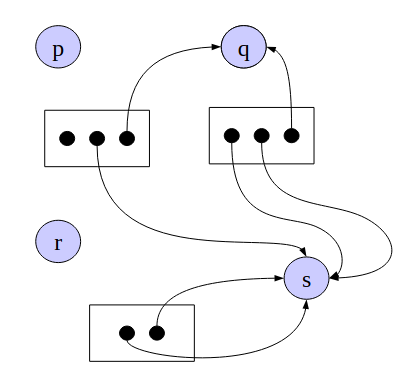
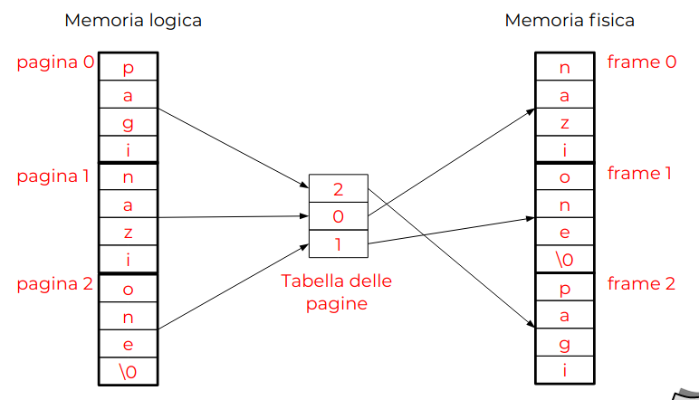
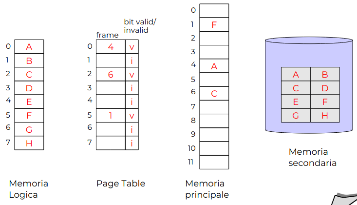
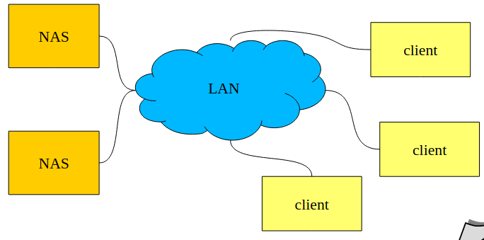

# Introduzione ai Sistemi Operativi

Un **Sistema operativo** è livello di astrazione:
- Realizza il concetto di processo
- Il "linguaggio" fornito dal SO è definito dalle system call
- Implementato tramite un programma che **controlla l'esecuzione di programmi applicativi** e agisce come **interfaccia tra le applicazioni e l'hardware** del calcolatore

Gli **obbiettivi** sono ottenere *Efficienza* e *Semplicità*

Un sistema operativo nasconde i dettagli dell'hardware ai programmatori tramite una API che agisce come intermediario.

Servizi estesi offerti da un SO (classi di System Call):
- Esecuzione dei programmi
- Accesso ai dispositivi I/O
- Accesso a File System
- Accesso a networking
- Accesso al sistema
- Rilevazione e risposta agli errori
- Accounting (Come gestione di timer, utilizzo di memoria, ecc)

## Storia dei Sistemi Operativi

- **Generazione 1**: 1945 - 1955
	- Valvole e tavole di commutazione
- **Generazione 2**: 1955 - 1965
	- Transistor e Sistemi Batch
- **Generazione 3**: 1965 - 1980
	- Circuiti integrati, multiprogrammazione e time-sharing
- **Generazione 4**: 1980 - oggi
	- Personal Computer

### Generazione 0
**Babbage (1792-1871)**
- Macchina programmabile e meccanica
- Niente SO

### Generazione 1
- Macchine a valvole e tavole di commutazione
- Solo calcoli numerici, gruppi di persone per singolo computer
- Venivano programmati direttamente in linguaggio macchina
- Ovviamente nessun SO

Problemi:
- Guasti frequenti
- Utilizzazione lenta e complessa

### Generazione 2
- Iniziano ad essere usati i transistor
- Più economici e più affidabili
- Iniziano quindi ad avere mercato e ad affermarsi
- Programmazione in Assembly e Fortran, tramite schede perforate
- Sistema operativo "batch"

Definizione: **JOB**
- Un programma o un insieme di essi la cui esecuzione veniva richiesta da uno degli utenti del computer

Ciclo di esecuzione di un job:
- Il programmatore scrive il programma su carta, perfora le schede e consegna le schede all'operatore
- L'operatore inserisce le schede di controllo, poi quelle del programma, attente il risultato e lo consegna al progammatore

Primi rudimentali esempi di SO, detti anche *monitor residenti*
- Controllo iniziale del monitor
- Controllo ceduto al job corrente
- Terminato, il job resituisce il controllo al monitor

**Sistema batch** = "infornata"

Problemi:
- Molte risorse inutilizziate, il passaggio da un job ad un altro rende parte del processore inutlizzato
- Primo miglioramento caricando i job su un nastro (off-line), elaborazione con output sul nastro ed infine stampa sul nastro di output (off-line)

### Generazione 3
Utilizzo di circuiti integrati, ci si sposta ad un utente come operatore

Venivano programmati in C, si usavano editor testuali, compilatori. Si aveva accesso al sistema da terminali

Sistemi operativi **interattivi**, **multi-programmazione** e **time sharing**

- **Multi-programmazione**
	- Utilizzare il processo durante i periodi di I/O di un job per eseguire altri job
	- Il vantaggio è lo sfruttamento totale del processore in caso di operazioni I/O lunghe, oltre all'utilizzo migliore di memoria
	- Caratteristiche dei SO multiprogrammati
		- Le routine di I/O devono essere fornite dal SO
		- Gestione della memoria come stack
		- CPU scheduling, il SO sceglie quale job eseguire
		- Allocazione delle risorse di I/O
- **Time sharing**
	- Estensione logica della multi-programmazione
	- Esecuzione della CPU divisa in $n$ *quanti* temporali
	- Allo scadere di un *quanto*, si passa ad un altro job (anche in assenza di richieste di I/O
	- I passaggi (*context switch*) avvengono così frequentemente che più utenti possono interagire con i programmi in esecuzione
	- Caratteristiche dei SO time sharing
		- Gestione della memoria come memoria virtuale
		- CPU scheduling di tipo *preemptive* e *time-sliced*
		- Meccanismi di protezione per utilizzo multi utente

Unix era la riscrittura in C dei SO scritti in Assembly

### Generazione 4
Personal computer dedicati ai singoli utenti, con l'obbiettivo primario della facilità d'uso

Sottovalutazione della sicurezza, solo dopo i SO dei PC furono resi sicuri

## Sistemi paralleli
Un singolo elaboratore che possiede più unità di elaborazione

Due tipi: **SIMD** (Single Instruction, Multiple Data) e **MIMD** (Multiple Instruction, Multiple Data)

- Sistemi **tightly** coupled
	- Bus / Memoria condivisa
	- Pochi processi / Basso livello di parallelismo. Bus = bottleneck
- Sistemi **loosely** coupled
	- Processori con memoria privata interconnessi da canali
	- Tanto processori, alto livello di parallelismo

- Symmetric multiprocessing (SMP)
	- Ogni processore esegue una copia identica del SO
	- Processi diversi eseguibili contemporaneamente
	- Molti SO supportano SMP
- Asymmetric multiprocessing
	- Ogni processore è assegnato ad un compito specifico, un processore master gestisce l'allocazione
	- Comune in sistemi molto grandi

## Sistemi distribuiti
Sistemi composti da più elaboratori indipendenti. Esempio: Macchine di laboratorio

- Condivisione di file
- Possibilità di comunicare
- Ogni computer opera in modo indipendente
- Minore utonomia tra computer
- Dà l'impressione che un singolo SO stia controllando tutti gli elaboratoridi sistema distribuito

## Sistemi real-time
Sistemi per cui la correttezza del risultato dipende anche dall'istante nel quale il risultato viene prodoto

I sistemi real-time si dividono in:
- hard real-time
	- Se il mancato rispetto dei vincoli temporali può avere effetti catastrofici
- soft real-time
	- Se si hanno solamente disagi o disservizi

NB: real-time non significa necessariamente esecuzione veloce

# Modulo HW: richiami architetturali
## Architettura di Von Neumann

- Device -> Fatto di ferro
- Device Controller -> Hardware (silicio)
- Device Driver -> Software

- Memory Managment Unit -> Silicio
- Memory Manager -> Software

## Interrupt
Un meccanismo che permette l'interruzione del normale ciclo di esecuzione della CPU
- Permettono al SO di "intervenire" durante l'esecuzione di un programma
- Sia hardware che software
- Ci sono $n$ bit, uno per "filo" di interrupt, serve per non fare interrompere l'esecuzione alla CPU.
	- Questi bit sono nei registri della CPU 

### Trap
- **Interrupt Hardware**
	- Sono *asincroni*, come dispositivi di I/O, interval timer
	- Generati dai contoller stessi
- **Interrupt Software (Trap)**
	- Causato dal programma, come divisione per 0, system call

Gli interrupt sono segnali inviati **AL** processore

### Gestione Interrupt
- Segnale *interrupt request* spedito al processore
- Il processore salta alla routine di gestione dell'interrupt (**interrupt handler**)
- L'interrupt handler gestisce l'interrupt e ritorna il controllo al processo interrotto
- Il processore torna ad eseguire il processo interrotto

#### Esempio dettagliato
1. Un segnale di *interrupt request* viene spedito alla CPU
2. La CPU finisce l'esecuzione dell'istante corrente
3. La CPU verifica la presenza di un segnale di interrupt
4. Preparazione al trasferimento di controllo dal programma all'interrupt handler
	- Metodo 1: Salvataggio dei registri "critici"
	- Metodo 2: Scambio di stato
5. Selezione dell'interrupt handler appropiato
6. Caricamento del PC con l'indirizzo iniziale dell'interrupt handler assegnato
	- Nota: Tutte e operazioni fino ad ora sono **hardware**
7. Salvataggio dello stato precedente
	- Salvataggio delle informazioni critiche no salvate in 4
8. Gestione dell'interrupt
	- Lettura delle informazioni di controllo proveniente dal dispositivo
9. Ripristino dello stato del processore (inverso di 7)
10. Ritorno al processo in esecuzione

**I SO moderni sono detti Interrupt Driven**
- Il codice del SO entra in funzione come *interrupt handler*
- Sono gli interrupt/trap che guidano l'avvicendamento dei processi

### Interrupt Multipli
Esiste la possibilià che avvengano **interrupt multipli**
- Es. Originati da dispositivi diversi o interrupt annidati

Due possibili approcci:
- Disabilitazione degli interrupt
- Interrupt annidati

#### Disabilitazione degli Interrupt
- Durante l'esecuzione di un interrupt handler ulteriori interrupt vengono ignorati o rimangono pendenti
- Vengono riabilitati prima di riattivare il processo interrotto
- Il processore verifica che non ci siano più interrupt, in caso contrario attiva l'interrupt handler corrispondente

Il principale *vantaggio* è che l'approccio è più semplice, ma non si tiene conto di gestioni *time-critical*

#### Interrupt Annidati
- Possibile definire *priorità* per gli interrupt
- Interrupt con priorità superiore interrompono gli handler di interrupt di priorità inferiore
- Necessari meccanismi di salvataggio

Il principale *vantaggio* è che dispositivi veloci possono essere serviti prima, ma l'approccio è più complesso e occorrono più stack

## Dispositivi I/O
Il controllore governa il dialogo con il dispositivo fisico. Esempi:
- Il controller di un disco accetta una richiesta per volta
- L'accodamento delle richieste in attesa è a carico del SO

Due modalità possibili: **Programmed I/O** e **Interrupt-Driven I/O**

### Programmed I/O (obsoleto)
Operazione di Input:
- La CPU carica tramite bus i parametri della richiesta in appositi registri del controller
- Il dispositivo esegue la richiesta, il risultato viene memorizzato in un buffer locale sul controller, viene segnalata la fine tramite appositi registri di status
- Il SO attende (**busy waiting/polling**) che il comando sia completato
- Infine la CPU si salva i dati dal buffer del controller

### Interrupt Driven I/O
Operazione di Input:
- La CPU carica tramite bus i parametri della richiesta in appositi registri del controller
- *Il SO sospende l'esecuzione del processo e ne esegue un altro*
- Il dispositivo esegue la richiesta, il risultato viene memorizzato in un buffer locale sul controller, *viene segnalata la fine tramite interrupt*
- *al ricevimento dell'interrupt* la CPU copia i dati dal buffer in memoria

Nel caso di operazioni di output il procedimento è simile con entrambi i metodi \\
Il principale svantaggio è che la CPU è lenta nel trasferimento dati

### Direct Memory Access (DMA)
Il SO attiva l'operazione di I/O specificando l'indirizzo in memoria di destinazione/provenienza dei dati, il controller prende/pone i dati direttamente in memoria centrale e l'interrupt specifica solamente la conclusione di I/O

C'è contesa all'accesso al bus, ma i device driver sono più semplici. È possibile perchè la CPU non accede al bus ad ogni ciclo di clock

## Gestione della Memoria
Memoria Centrale (RAM)
- Assieme ai registri l'unico spazio che può essere acceduto *direttamente* dalla CPU. Accesso tramite `LOAD` e `STORE`
- È memoria *volatile*, nei sistemi moderni l'accesso è tramite MMU

### Memory Mapped I/O
Quando un dispositivo è completamente indirizzabile tramite bus, quindi i dati vengono gestiti tramite indirizzi di memoria in RAM, la modifica causa il trasferimento dati da/verso il dispositivo

Ad esempio il video grafico nei PC

Il vantaggio è la gestione semplificata, ma rende necessarie tecniche di **sincronizzazione** di accesso

### Dischi
Dispositivi che consentono la memorizzazione non volatile dei dati

Il controller gestisce:
- `READ(head, sector)`
- `WRITE(head, sector)`
- `SEEK(cylinder)`

`SEEK` corrisponde allo spostamento fisico del pettine della testina da un cilindro ad un altro, normalmente più costosa

### SSD
Numero di cicli di scrittura limitato, si leggono a blocchi e si scrivono a banchi (numerosi blocchi)

### Gerarchia di memoria

Nota: SAN = Storage Area Network, rete di dischi

### Cache
Memorizzare **parzialmente** i dati di una memoria in una seconda più costosa ma più efficente. \\
Si applica a diversi livelli, sia hardware (CPU) che software (disco)

Bisogna considerare un algoritmo di *replacement* e la coerenza dei dati

## Protezione Hardware
I segnali multiprogrammati e multiutente richiedono di **meccanismi di protezione**, devono evitare che processi utente interferiscano con il SO. Può essere fatto solo software o è necessario anche meccanismo hardware?

### Modo Utente / Modo Kernel
Un processo in *kernel mode* può fare tutto, in *user mode* invece può accedere solo agli indirizzi per i suoi programmi in esecuzione (quindi si interfaccia con i device a cui ha accesso)

**Kernel mode**/supervisore/privilegiata/**ring 0**:
- I processi in questa modalità hanno accesso a tutte le istruzioni, anche quelle *privilegiate*

**User mode**:
- Non si ha accesso alle istruzioni privilegiate

**Mode bit**: Bit nello *status register* per distinguere tra user/kernel mode

Alla partenza il processore è in modalità kernel, dopo aver caricato il SO il controllo passa ad un processo utente, quindi il **mode bit** cambia stato e passa in modalità utente \\
Quando avviene un *interrupt* l'hardware passa in modalità kernel

### Protezione I/O
Istruzioni I/O sono *privilegiate*, le richieste passano per il SO

### Protezione Memoria
Fondamentale, avviene tramite la **Memory Management Unit (MMU)**, che è un dispositivo hardware \\
Traduzione di indirizzi logici in indirizzi fisici, gli indirizzi protetti sono quelli che non possono essere tradotti (agisce come una funzione la MMU)

### System Call
Le istruzioni di I/O sono privilegiate, e possono essere eseguite solo dal SO, i processi utente possono accedere ai device tramite delle **System Call**, che sono *trap* generate da istruzioni specifiche

# Architettura dei Sistemi Operativi
Diversi punti di vista:
- **Servizi forniti**
- **Interfaccia di sistema**
- **Componenti di sistema**

## Componenti di un SO
- Gestione dei processi
- Gestione della Memoria principale
- Gestione della Memoria secondaria
- Gestione del File System
- Gestione dei dispositivi di I/O
- Supporto *multiuser*
- Networking
- *Inter Process Communication* (IPC)

### Gestione dei processi
Un processo è un programma in esecuzione, il SO è responsabile di:
- Creazione e terminazione
- Sospensione e riattivazione
- Gestione del deadlock
- Comunicazione tra essi
- Sicronizzazione tra essi

### Gestione della memoria principale
La memoria principale è volatile, ed è sostanzialmente un array di byte indirizzabili singolarmente, il SO è responsabile di:
- Tenere traccia di quali parti di memoria sono usate e da chi
- Decidere quali processi caricare quando diventa disponibile spazio
- Alloca e dealloca
- Usa memoria secondaria per *ampliare* la memoria principale (*virtual memory*)

### Gestione della memoria secondaria
La memoria secondaria è non volatile, e serve per contenere dati in modo permanente, il SO è responsabile di:
- Gestione partizionamento
- Gestione dell'accesso efficiente e affidabile (RAID)
- *Disk Scheduling*

### Gestione dell'I/O
Richiede:
- Interfaccia comune per la gestione dei device driver
- Insieme di driver per dispositivi HW specifici
- Sistema di gestione di buffer per la cache

### Gestione del file system
Un file è l'astrazione informatica di un archivio di dati \\
Un *file system* è composto da un insieme di file

Il SO è responsabile di:
- Creazione e cancellazione di file e di directory
- Manipolazione di questi ultimi
- Codifica del file system su una sequenza di blocchi

### Supporto Multiuser - protezione
"Protezione" si riferisce al meccanismo per controllare gli accessi dei processi, esso è SW e deve:
- Gestire l'identità del *proprietario* del processo
- Gestire *chi può fare cosa*
- Fornire un meccanismo per attuare la protezione

### Networking
Consente di far comunicare processi in esecuzioni su più macchine (o anche nella stessa macchina), e di condividere risorse

Servizi:
- Protocolli di comunicazione a basso livello
	- TCP/IP
	- UDP
- Servizi di comunicazione ad alto livello
	- File system distribuiti (NFS, SMB)

## Struttura del programma "SO"
- Sistemi con struttura semplice
- Sistemi con struttura a stati
- Microkernel
- Macchine virtuali
- Progettazione di un SO

### Sistemi con struttura semplice
SO che non hanno una struttura progettata a priori. Descritti come collezione di procedure

Tipicamente sono SO semplici e limitati che hanno subito un'evoluzione al di là dello scopo originario

#### MS-DOS - Free-DOS
Interfacce e livelli di funzionalità non sono ben separate, quindi un programma solo può mandare in crash l'intero sistema

#### UNIX

Anche UNIX è poco strutturato. È diviso in due parti, il *kernel* e i *programmi di sistema*

Il *kernel* è delimitato dal basso dall'hardware, dall'alto alle system call

### Sistemi con struttura a stati
Il SO è strutturato tramite *layer*, ogni *layer* è basato sugli stati inferiori e offre servizi agli stati superiori

Il principale vantaggio è la modularità
- *encapsulation* e *data hiding*
- *abstract data types*

Vengono semplificati implementazione, debugging e ristrutturazione di sistema

**Problemi**:
- Tendono ad essere meno efficienti, ogni strato aggiunge overhead (anche minimo)
- Occorre studiare attentamente la struttura dei layer (API)

**Risultato**:
I moderni sistemi con struttura a strati tendono ad avere meno strati

### Politiche e meccanismi
La politica decide cosa deve essere fatto, e i meccanismi attuano la decisione

La componente che prende le decisioni può essere diversa da quella che implementa i meccanismi, questo rende possibile cambiare uno senza cambiare l'altro

Nei sistemi a microkernel ci stanno solo i meccanismi, le decisioni politiche sono decise da un componente esterno (processi)

Al contrario in MacOS <= 9 e Windows 9x politiche e meccanismi gestiti sono inserite nel kernel, anche la gestione del server grafico, così hai un unico look'n'feel

### Kernel
#### Kernel Monolitici
Aggregato unico di procedure di gestione mutualmente coordinate, molto efficente

Le system call sono servizi forniti dal kernel, eseguite in kernel mode

Esiste modularità, anche se esiste un unico corpo in esecuzione

Se fallisce un processo in kernel mode c'è un kernel panic, e il sistema va in crash

I moderni kernel monolitici (Linux, FreeBSD, UNIX) permette il caricamento di moduli eseguibili a runtime

#### Microkernel
I kernel però possono continuare a crescere in complessità, con i microkernel invece vengono mantenute all'interno del kernel solo le parti essenziali:
- Funzionalità minime di gestione dei *processi* e della *memoria*
- Meccanismi di comunicazione per permettere ai processi client di chiedere servizi ai processi server, comunicazione basata sul **message passing**

Le system call di un SO basato su microkernel sono `send` e `receive`, tramite queste è posibile implementare l'API standard di gran parte dei SO

**Vantaggi**:
- Kernel semplice e facile da realizzare
- Più espandibile e modificabile (per aggiungere un servizio basta aggiungere un processo a livello kernel
- Più portabile e robusto
- Più sicuro
- Più adatto a sistemi distribuiti

**Svantaggi**:
- Maggiore inefficienza

#### Kernel Ibridi
Sono microkernel modificati, mantengono una parte di *kernel space* per ragioni di maggiore efficienza, il resto viene gestito tramite API \\
Per esempio Windows ha la parte grafica nel kernel

NB: Sono diversi dai kernel monolitici in grado di effettuare il caricamento di moduli a run-time

### Macchine virtuali
Approccio diverso al multitasking, si crea l'astrazione di una macchina virtuale

Le VM emulano il funzionamento dell'hardware, quindi possono emulare anche architetture HW diverse

Gli svantaggi sono l'**inefficienza** e la **difficoltà di condivisione delle risorse**

**HyperVisor**: Componente che gestisce il passaggio di istruzioni tra HW e VM

Due tipi di VM:
- ABI, mascherano HW e SO, fornita da una **PVM** (Process VM)
- ISA, maschera solo HW, fornita da una **SVM** (System VM)

**KVM** (Kernel Virtual Machine): Le istruzioni passano direttamente alla CPU, solo in caso di *trap* la CPU passa la gestione all'*hypervisor* \\
Nota: Bisogna che sia la stessa architettura per usare KVM

### Progettazione di un SO
Definire **obbiettivi** e **costraint** che vogliamo e abbiamo \\
La progettazione sarà influenzata dall'HW dal basso e dalle applicazioni dal sistema dall'alto

#### Tailoring the OS
Configurare il SO per avere esattamente le caratteristiche necessarie, perciò è necessario prevedere meccanismi per la generazione del SO specifico per l'architettura utilizzata

#### System Generation

I parametri tipici per la generazione di un SO sono:
- Tipo di CPU
- Quantità di memoria centrale
- Periferiche utilizzate
- Numero utenti, processi, ampiezza del buffer, tipo di processi, ecc

I metodi che possono essere utilizzati sono:
- Rigenerazione del kernel con nuovi parametri/driver (UNIX e Linux)
- Prevedere la gestione di moduli aggiuntivi collegati al boot
	- Moduli Linux
	- Estensioni Kernel (MacOS)
	- Kernel-Mode Driver Windows

# Scheduling
## Scheduler, Processi e thread
Un SO è un gestore di risorse (processore, memoria primaria e secondaria, dispositivi)

Ha bisogno quindi di strutture dati per mantenere informazioni sulle risorse gestite
- Tabelle di memoria
	- Allocazione memoria, informazioni per i meccanismi di protezione
- Tabelle di I/O
	- Informazioni sull'assegnamento dei dispositivi utilizzati dalla macchina
	- Gestione di code di richieste
- Tabelle del file system
	- Elenco dispositivi utilizzati per manetenere il file system
	- Elenco file aperti e loro stato
- Tabelle dei processi
	- Di cui parliamo

### PCB
Manifestazione fisica di un processo:
- Codice da eseguire (segmento codice)
- Dati su cui operare (segmento dati)
- Stack di lavoro per la gestione di chiamate di funzione, passaggio dei parametri e variabili locali
- **Insieme di attributi** contenente tutte le informazioni per la gestione del processo stesso 

Questo insieme di attributi si chiama Descrittore di Processo, **Process Control Block** (PCB)

La **tabella per la gestione dei processi** contiene i PCB, ogni processo ne ha uno associato

Informazioni contenute nel PCB:
- Informazioni di identificazione di processo
	- Identificatore di processo (pid), può essere semplicemente un indice, e/o un numero progressivo
	- Identificatori di altri processi logicamente collegati al processo, come il pid del padre
	- ID dell'utente che ha richiesto l'esecuzione del processo
- Informazioni di stato del processo
	- Registri generali del processore
	- Registri speciali (Program Counter, registri di stato, ecc)
- Informazioni di controllo del processo
	- Scheduling
		- Stato del processo
		- Informazioni particolari per l'algoritmo di scheduling utilizzato
		- identificatore dell'evento per cui il processo è in attesa
	- Gestione della memoria
		- Configurazione della MMU (Es. Puntatori alle tabelle delle pagine)
	- Accounting
		- Tempo di esecuzione del processo
		- Tempo trascorso dall'attivazione di un processo
	- Risorse
		- Risorse controllate dal processo
	- InterProcess Communication
		- Stato di segnali, semafori, ecc

### Scheduler
Componente più importante del kernel, gestisce l'avvicentamento dei processi
- Decide quale processo deve essere in esecuzione
- Interviene quando deve essere gestita una operazione di I/O

#### Schedule - Scheduling - Scheduler
**Schedule**: Sequenza temporale di assegnazioni delle risorse da gestire ai richiedenti

**Scheduling**: Azione di calcolare uno schedule

**Scheduler**: Componente software che calcola la schedule

### Content Switching
Tutte le volte che avviene un interrupt il processore è soggetto ad un *mode switching*

Durante la gestione dell'interrupt:
- Chiamato lo scheduler
- Se lo scheduler decide di eseguire un altro processo, il sistema è soggetto ad un **context switching**
- Lo stato del processo attuale viene salvato nel PCB corrispondente
- Lo stato di quello selezionato viene caricato dal PCB al processore

#### Schema di funzionamento di un kernel

### Vita di un processo

### Gerarchia di processi
Nella maggioranza dei SO quando un processo crea un nuovo processo il figlio viene creato ad immagine del padre, si crea così un albero di processi

Così è più semplice il procedimento di creazione di processi, ciò che non viene specificato viene ereditato dal padre

### Processi e Thread
Tutti i SO moderni supportano processi multithreaded, in questi ultimi esistono diverse linee di controllo, ognuna delle uali può eseguire un diverso insieme di istruzioni
- Es. Un thread per ogni finestra aperta del browser

Ogni thread possiede la propria copia dello **stato del processore**, il proprio **program counter** e uno **stack separato**

I thread condividono lo spazio in memoria e le risorse
- Es. Condivisione di parametri di configurazione tra i vari thread

Gestire i thread è più economico in generale, creare thread all'interno dello stesso processo e fare *context switching* tra thread è meno costoso

#### User Thread
Vengono supportati sopra il kernel e vengon implementati da una **thread library** a libello utente

- Vantaggi: Implementazione molto efficiente
- Svantaggi: Se il kernel è single-threaded, qualsiasi system call bloccante causa il blocco dell'intero processo

#### Kernel Thread
Vengono supportati direttamente dal SO

- Vantaggi: Se un thread esegue una operazione di I/O il kernel può selezionare un altro thread in attesa di essere eseguito
- Svantaggi: L'implementazione è più lenta, perchè richiede un passaggio da utente a supervisore

## Scheduling
### Rappresentazione degli schedule
Per rappresentare uno schedule si usano i diagrammi di Gantt

### Tipi di scheduler
Eventi che possono causare un context switch
1. Stato *running* -> *waiting* (seleziono altro processo per l'esecuzione)
2. Stato *running* -> *ready* (continuo l'esecuzione)
3. Stato *waiting* -> *ready* (continuo l'esecuzione)
4. Quando termina (seleziono altro processo per l'esecuzione)

- Scheduler **non-preemptive** o **cooperativo**
	- Se i *context switch* avvengono solo per condizioni 1 e 4
	- In altre parole "Il controllo della risorsa viene trasferito solo se l'assegnamento attuale lo cede *volontariamente*"
	- Vecchi SO

- Scheduler **preemptive**
	- Se i *context switch* possono avvenire in qualsiasi condizione
	- In altre parole "Il controllo della risorsa viene volto all'assegnatoario attuale a causa di un evento"
	- Tutti gli Scheduler moderni

### Criteri di scelta di uno scheduler
- Utilizzo della risorsa (CPU)
	- Tempo in cui la CPU è occupata ad eseguire processi
	- Da massimizzare
- Throughput
	- Numero di processi completati per unità di tempo
	- Da massimizzare
- Tempo di turnaround
	- Tempo che intercorre dalla sottomissione di un processo alla sua terminazione
	- Da minimizzare
- Tempo di attesa
	- Tempo trascorso da un processo nella coda ready
	- Da minimizzare
- Tempo di risposta
	- Tempo che intercorre tra la sottomissione di un processo e il tempo di *prima risposta*
	- Da minimizzare (importante per programmi interattivi)

### Caratteristiche dei processi
Durante l'esecuzione di un processo:
- Si alternano periodi di attività svolte dalla CPU (*CPU burst*)
	- Processi con questa caratteristica sono detti *CPU bound*
- E periodi di attività di I/O (*I/O burst*)
	- Processi con questa caratteristica sono detti *I/O bound*

### Algoritmi di Scheduling
- First Come, First Served
- Shortest-Job First
	- Shortest-Next-CPU-Burst First
	- Shortest-Remaning-Time First
- Round-Robin

#### First Come, First Served (FCFS)
Chi prima arriva prima viene servito, politica senza *preemption*

Implementazione tramite una semplice coda FIFO

Problemi:
- Elevati tempi medi di attesa
- Processi CPU bound ritardano i processi I/O bound

Chiaramente non adatto a situazioni interattive, i processi I/O bound si mettono in coda dietro al processo CPU bound, e in alcuni casi la *ready queue* si può svuotare  (Convoy effect)

#### Shortest Job First (SJF)
Cerchiamo di stimare la durata di un processo che deve essere eseguito, così da far eseguire prima i processi più veloci

Nella pratica non è implementabile, bisogna fare una stima approssimativa basata sul CPU burst dell'esecuzione del processo eseguita precedentemente

Si usa la *media esponenziale*:
$$\tau_{n+1} = \sum_{j = 0 \dots n} \alpha (1 - \alpha)^j t_{n-j} + (1 - \alpha)^{n+1} \tau_0$$

Nota: SJF può essere soggetto a starvation

Ne esistono due versioni:
- **non preemptive**: Processo corrente esegue fino al completamento del suo CPU burst
- **preemptive**: Processo corrente può essere messo nella coda ready, "Shortest-Remaining-Time First"

#### Scheduling Round-Robin
Un processo non può rimanere in esecuzione per un tempo superiore alla durata del *quanto di tempo*

Implementazione:
- L'insieme dei processi pronti è organizzato come una coda, due possibilità:
- Un processo può lasciare il processore *volontariamente*, in seguito ad un'operazione di I/O
- Un processo può *esaurire il suo quanto di tempo* senza completare il suo CPU burst, nel qual caso viene aggiunto in fondo alla coda dei processi pronti
- Necessario che l'hardware fornisca un timer (*interval timer*) che agisca come "sveglia" del processore
- È un dispositivo che è in grado di fornire un interrupt allo scadere del tempo prefissato
- Il timer viene interfacciato come se fosse un'unità di I/O

La durante del quanto di tempo è un parametro critico, se è breve il sistema è meno efficente (cambia processo spesso), se è lungo in caso di numerosi processi pronti ci sono lunghi periodi di inattività di ogni singolo processo

Problemi:
- Non c'è un processo più importante degli altri, però questo è troppo democratico
	- Ad esempio una mail può aspettare 500ms, un frame video no
- Abbiamo bisogno di un dispositivo HW per scandire il tempo

#### Scheduling a priorità
Ad ogni processo è associata una specifica priorità, e lo scheduler sceglie il processo pronto con la priorità più alta

Priorità definite:
- Dal Sistema operativo (SJF sistema basato su priorità definite da SO)
- Esternamente (imposte dal livello utente)

Diversi tipi di priorità:
- **Statica**: Non cambia durante la vita dei processo (ma processi a bassa priorità possono essere soggetti a *starvation* da processi ad alta priorità)
- **Dinamica**: Varia durante la vita del processo, così da evitare *starvation*
- **Aging**: Più il processo è rimasto in attesa più ha una priorità alta, altro modo per evitare starvation

##### Scheduling a Classi di priorità
È possibile creare diverse *classi di processi* con caratteristiche simili per assegnare ad ogni classe diverse priorità

##### Scheduling Multilivello
All'interno di ogni classe è possibile usare una politica specifica adatta alla classe \
Quindi dopo aver scelto un processo dalla classe con priorità più alta sceglie il processo in base alla politica interna alla classe

#### Scheduling Real Time
In un sistema real time la correttezza del risultato dipende anche dal tempo in cui il risultato viene emesso

Nei sistemi **Hard real time** è necessario non superare mai la deadline di esecuzione dei programmi \
Nei sistemi **Soft real time** sono tollerabili errori occasionali

- Processi periodici: Processi che vengono riattivati con una cadenza regolare
- Processi aperiodici: Processi che vengono scatenati da un evento sporadico

##### Esempi di Scheduler Real Time
- **Rate Monotonic**: Politica di Scheduling, valida alle seguenti condizioni
	- Ogni processo periodico deve completare entro il suo periodo
	- Tutti i processi sono indipendenti
	- La preemprion avviene istantaneamente e senza overhead
- Assegnata staticamente la priorità ad ogni processo

- **Earliest Deadline First**: Politica di scheduling per processi periodici real time
	- Viene scelto di volta in volta il processo che ha la deadline più vicina

# Risorse
## Classi di risorse
Risorse suddivisi in classi, risorse apparteneneti alla stessa classe sono equivalenti
- Esempio: Byte della memoria, Stampanti dello stesso tipo, ecc

Risorse di una classe = **Istanze**
Numero di risorse in una classe = **Molteplicità**

Un processo non può richiedere una specifica risorsa, ma solo una risorsa di una specifica classe

## Assegnazione delle risorse
- **Allocazione Statica**
	- Avviene al momento della creazione del processo, termina alla terminazione del processo stesso
	- Esempi: *Descrittori*, *Aree di memoria* (in alcuni casi)
- **Allocazione Dinamica**
	- Richiesta durante l'esistenza di un processo, terminazione a fine dell'utilizzo
	- Esempi: *Periferiche di I/O*, *Aree di memoria* (in alcuni casi)

## Tipi di richieste
- **Richiesta singola**
	- Singola risorsa di una classe definita
- **Richiesta multipla**
	- Una o più classi, per ogni classo ad una o più risorse
- **Richiesta bloccante**
	- Processo richiedente si sospende se non ottiene l'assegnazione
- **Richiesta non bloccante**
	- Mancata assegnazione viene notificata al processo, senza provocarne la sospensione

## Tipi di risorse
- **Risorse non condivisibili** (seriali)
	- Esempi: *Processori*, *sezioni critiche*, *stampanti*
- **Risorse condivisibili**
	- Esempi: *File in sola lettura*
- **Risorse Prerilasciabili** (*preemptable*)
	- Se la funzione di gestione della risorsa può sottrarla ad un processo prima che abbia finito di usarla
	- Il processo che subisce il prerilascio deve quindi sospendersi, e dopo che sarà stata utilizzata tornerà al processo sospeso
	- Prerilasciabile se lo stato non si modifica durante l'utilizzo (o se può essere facilmente salvato/ripristinato)
	- Esempi: *Processore*, *Blocchi o partizioni di memoria*
- **Risorse non prerilasciabili**
	- Il contrario

## Deadlock
### Condizioni necessarie per un deadlock
- Mutua esclusione o non condivisibilità
- Assenza di prerilascio
- Richieste bloccanti (*hold and wait*)
- Attesa circolare

Devono valere tutte queste affinchè si presenti un *deadlock*, tutte e quattro queste condizioni diventano anche sufficienti

### Grafo di Holt
Grafo per riconoscere se è un processo è in *deadlock*

Caratteristiche:
- Grafo *diretto*: archi monodirezionali
- Grafo *bipartito*: Composto da due sottoinsiemi (*risorse* e *processi*), archi partono da un sottoinsieme e arriva all'altro
- Archi *risorsa -> processo* indica l'assegnamento della risorsa al processo
- Archi *processo -> risorsa* indica la richiesta della risorsa da parte del processo
- I Processi sono rappresentati da *cerchi*
- Le Classi sono rappresenetate come *contenitori rettangolari*
- Le Risorse sono rappresentate come *punti* all'interno delle classi
- **Nota**: Non si rappresentano archi se le relative richieste possono essere soddisfatte

#### Notazione operativa
- Archi
	- Molteplicità della richiesta/assegnazione
- All'interno delle classi
	- Numero di risorse non ancora assegnate

### Metodi per la gestione del Deadlock
- **Deadlock detection and recovery**
	- Permettere al sistema di entrare in stati di deadlock, utilizzare un algoritmo per rilevare questo stato ed eseguire una operazione di recovery
- **Deadlock prevention/avoidance**
	- Impedire al sistema di entrare in deadlock
- **Ostrich Algorithm** (Algoritmo dello struzzo)
	- Ignorare il problema (Il più usato)

### Deadlock Detection
Manteniamo un grafo di Holt e utilizziamolo per controllare i deadlock, come si riconoscono?

Se ho una sola risorsa per classe basta che ci sia un ciclo per avere deadlock

Se abbiamo più risorse per classe allora non basta il ciclo, dobbiamo ridurre il grafo di Holt
- Rimuoviamo gli archi di un nodo se ha solo archi entranti
- Assegnamo le risorse di classi libere agli atri processi
- Ripetiamo per altri nodi

Se il grafo è **completamente riducibile** (ovvero esiste una sequenzadi passi di riduzione che eliina tutti gli archi del grafo) allora *non c'è deadlock*

#### Esempio

### Deadlock Detection - Knot
- Dato un nodo `n`, l'insieme dei nodi raggiungibili da `n` viene detto *insieme di raggiungibilità* di `n` (`R(n)`)
- Un **knot** del grafo è un sottoinsieme `M` non banale tale che per ogni elemento `n` di `M`, `R(n)` = `M`

**Teorema**:
- Dato un grafo di Holt con una sola richiesta sospesa per processo
- Se le risorse sono *a richiesta bloccante*, *non condivisibili* e *non prerilasciabili*
- Allora il grafo rappresenta uno stato di deadlock se e solo se esiste un knot

### Deadlock Recovery
La soluzione dopo il rilevamento di un deadlock può essere manuale o automatica
- **Terminazione totale**
- **Terminazione parziale** (un processo alla volta "sperando" che il deadlock sparisca)
- **Checkpoint/Rollback**
	- *Checkpoint*: Stato dei processi salvato su disco periodicamente
	- *Rollback*: Se c'è *deadlock*, si ripristinano uno o più processi finchè il *deadlock* non scompare

Terminare i processi può essere costoso e può lasciare risorse in uno stato incoerente

### Deadlock Prevention
Per evitare il *deadlock* si elimina una delle 4 condizioni, così da eliminarlo *strutturalmente*
- Eliminare Mutua Esclusione
	- Permettere condivisione di risorse
	- Problema: Non si può usare sempre (descrittori) e può finire lo spazio in coda (stampanti)
- Eliminare Richiesta Bloccante
	- Rende possibile richiedere che un processo richieda tutte le risorse all'inizio della computazione
	- Problemi: Parallelismo ridotto e l'insieme delle richieste non è sempre noto all'inizio
- Eliminare Assenza di prerilascio
	- Non sempre possibile
- Eliminare Attesa Circolare
	- Necessario creare una gerarchia per le classi di risorse, se un processo vuole allocare un risorsa a priorità `n`, deve rilasciare tutte quelle a priorità maggiore di `n`
	- Problema: Inefficiente

### Deadlock Avoidance
Prima di assegnare una risorsa ad un processo, si controlla se l'operazione può portare ad un *deadlock*, in caso l'operazione viene ritardata

**Algoritmo del Banchiere** (Dijkstra)
- Un banchiere desiderea condividere un capitale (fisso) con un numero (prefissato) di clienti
- Ogni cliente specifica in anticipo la sua necessità massima di denaro
- I clienti fanno due tipi di operazioni: *richieste* di prestito o *restituzioni*
- Ogni volta che le richieste vengono accolte si garantisce la restituzione in un tempo finito

Descrizione:
- $N$ = Numero di clienti
- $IC$ = Capitale iniziale
- $c_i$ = Limite di credito del cliente $i$ ($c_i \leq IC$)
- $p_i$ = Denaro prestato al clinte $i$ ($p_i \leq c_i$)
- $n_i = c_i - p_i$ = Credito residuo del cliente $i$
- $COH = IC - \sum_{i=1, ... N} p_i$ = Saldo di cassa

**Stato SAFE**: Sostanzialmente se la disponibilità in ogni situzione è maggiore del credito residuo del cliente successivo in una permutazione dei clienti
- Formalmente:
	- Sia $s$ una permutazione di $1, ..., N$
	- Vettore $avail$
		- $avail[1] = COH$
		- $avail[j+1] = avail[j] + p_{s(j)}$
	- Stato SAFE se vale $n_{s(j)} \leq avail[j]$

**Stato UNSAFE**: Condizione necessaria *ma non sufficiente* per il deadlock

#### Esempio Stato SAFE

#### Esempio Stato UNSAFE

Se il cliente 5 restituisce il suo prestito di 35 euro la situazione ritorna SAFE, quindi arrivare ad una situazione UNSAFE non implica deadlock

Nel nostro caso il denaro sono le risorse, se abbiamo più classi di risorse? Basta considerare più valute

### Algoritmo del banchiere multivaluta
Usiamo un vettore per indicare le risorse

Tutto il resto è analogo al caso con singola valuta/singola classe

**Problema**: La regola per ordinare i processi secondo i valori di $n_i$ non è applicabile, l'ordine può essere in generale diverso tra le diverse valute \
**Soluzione**: Si può creare la sequenza procedendo passo passo aggiungendo un processo a caso tra quelli interamente soddifacibili, ovvero al passo $j$ si sceglie quelli per cui $n_{s(j)} \leq avail[j]$

**Teorema**: Se durante la costruzione della sequenza $s$ si giunge ad un punto in cui nessun processo risulta soddisfacibile, lo stato non è SAFE. Quindi non esiste una sequenza che consenta di soddisfare tutti i processi \
Si dimostra per assurdo, vedendo che se in un punto non è possibile soddisfare le richieste (stato SAFE), e per assurdo potrebbe esserci un'altra sequenza per cui tutte le richieste sono soddisfacibili, questo implicherebbe che anche la prima sequenza sia soddisfacibile, quindi si raggiunge un assurdo

### Algoritmo dello struzzo
Decidere di non gestire i *deadlock*, perchè il costo per evitarli è troppo alto

Oggi la soluzione più adottata (UNIX e JVM)

# Gestione della Memoria
## Introduzione
La parte di SO che gestisce la memoria principale si chiama **Memory Manager**

In alcuni casi il memory manager può gestire anche parte della memoria secondaria, al fine di emulare memoria principale

I suoi compiti sono:
- Tenere traccia della memoria libera/occupata
- Allocare memoria ai processi e deallocarla quando non è più necessaria

Nota: **Memory Manager** è SW, **Memory Management Unit** (MMU) è HW

## Binding, Loading, Linking
 > Associazione di indirizzi logici di memoria ai corrispondenti indirizzi fisici

 Può avvenire durante:
 - *Compilazione*
 - *Caricamento*
 - *Esecuzione*

### Binding durante la Compilazione
Indirizzi vengono calcolari al momento della compilazione, e restano gli stessi ad ogni esecuzione del programma. Codice detto **assoluto**

Esempi: Arduino, Kernel, file COM

- **Vantaggi**
	- Non richiede HW speciale (Come MMU)
	- Semplice
	- Molto veloce
- **Svantaggi**
	- Non funziona con la multiprogrammazione

### Binding durante il Caricamento
Il compilato non contiene indirizzi assoluti ma relativi. Codice detto **rilocabile** \
Durante il caricamento il *loader* si preoccupa di aggiornare tutti i riferimenti agli indirizzi di memoria coerentemente all'indirizzo iniziale di caricamento

- **Vantaggi**
	- Permette multiprogrammazione
	- Non richiede HW speciale (Come MMU)
- **Svantaggi**
	- Richiede traduzione da parte del *loader*, quindi formati particolari per gli eseguibili

### Binding durante l'Esecuzione
Simile al Binding a Caricamento, ma fatto a RunTime dalla MMU

Spazio di indirizzamento **logico**
- Ogni processo è associato ad uno spazio di indirizzamento logico
- Gli indirizzi usati sono quelli logici

Spazio di indirizzamento **fisico**
- Ad ogni indirizzo logico ne corrisponde uno fisico
- La MMU opera come una funzione di traduzione da indirizzi logici ad indirizzi fisici

#### Esempi di MMU
**Riclocazione**: Utilizzo un registro per sapere di quanto aumentare l'indirizzo logico (Es. La CPU usa l'indirizzo logico 897, il registro per la rilocazione ha valore 24000, allora l'indirizzo effettivo utilizzato in memoria sarà 24897)

Si può anche aggiungere un **limite**, se l'indirizzo logico è maggiore/minore di quello allora va in errore

### Loading Dinamico
> Cosiste nel poter caricare alcune routine di libreria solo quando vengono richiamate

Viene implementato caricando le routine come un altro programma, solo quando vengono chiamate

Quindi rispetto al **Linking Statico** (dove tutti i riferimento vengono "risolti" a Compile Time), il **Linking Dinamico** posticipa il linking al momento di riferimento durante l'esecuzione

Consente quindi di avere eseguibili più compatti, ed esiste una sola istanza di libreria in memoria e tutti i processi eseguono il codice di quella istanza

**Vantaggi**: Oltre al rispario di memoria consente l'aggiornamento automatico delle versioni delle librerie

**Svantaggi**: Può causare problemi di versioning

Oggi si usa il linking dinamico tramite il linking dinamico, quindi è possibile al momento dell'esecuzione linkare in modo dinamico librerie aggiuntive (Si usa per i Plug-In)

## Allocazione
> Consiste nel reperire ed assegnare uno spazio di memoria fisica ad un programma

Allocazione:
- **Contigua**: Spazio assegnato formato da celle conseguive
- **Non Contigua**: Possibile assegnare aree di memoria separate (la MMU basata su rilocazione non la supporta)
- **Statica**: Il processo deve mantenere la propia area di memoria dal caricamento alla terminazione, non è possibile la rilocazione
- **Dinamica**: Il processo può essere spostato all'interno della memoria

### Allocazione a partizioni fisse
> La memoria disponibile (quella non occupata dal SO) suddivisa in partizioni. Ogni processo viene caricato in una differente partizione

**Statica e contigua**, molto semplice ma si spreca memoria. Inoltre c'è parallelismo limitato

Possibile utilizzare una coda per singola partizione o per tutte

Utilizzato nei sistemi monoprogrammati, come i *sistemi embedded*

#### Frammentazione Interna
Quando nell'allocazione a partizioni fisse il processo occupa una dimensione inferiore di quella della partizione che contiene, e quindi lo spazio non utilizzato rimane libero e sprecato

### Allocazioni a partizioni dinamiche
> La memoria disponibile viene allocata dinamicamente ai processi

**Statica e contigua**, possono esserci zone inutilizzate (processi che terminano o processi che usano meno memoria di quella allocata)

#### Frammentazione Esterna
"Buchi" tra le diverse partizioni, causate da susseguirsi di allocazioni e deallocazioni. Si risolve con la **compattazione**, rilocando i processi durante l'esecuzione

Il problema principale è che è il costo e che non può essere usata in sistemi interattivi

#### Strutture dati: Mappa di bit
> Memoria suddivisa in unità di allocazione, ogni unità assegnata ad un bit. Le unità se sono libere sono associate ad un bit di valore 0, se occupate associate ad un bit di valore 1

Il problema è che possiamo individuare uno spazio di memoria libera di $k$ bit in tempo $O(m)$, con $m$ numero di unità di allocazione. Quindi è molto lento

#### Strutture dati: Lista con puntatori
> Si mantiene una lista linkata dei blocchi allocati e liberi in memoria

La deallocazione di memoria può essere fatta in tempo $O(1)$, ma ha comunque problemi di efficienza

#### Come selezionare un blocco libero?
- First Fit: Scorre la lista di blocchi liberi finchè non ne trova uno libero grande abbastanza
- Next Fit: Invece di cercare il primo blocco libero dall'inizio della memoria cerca di riempire più omogeneamente la memoria ripartendo da dove ha allocato l'ultimo blocco
	- Più lento di First Fit
- Best Fit: Cerca il blocco più piccolo, ma grande abbastanza
	- Genera più frammentazione di First Fit
- Worst Fit: Il contrario
	- Difficile allocare processi di grandi dimensioni

## Paginazione
> Divide la memoria logica in **pagine** e la memoria fisica in **frame**, e rende possibile allocare memoria non contigua facendo credere al processo che sia contigua (necessita infatti di HW dedicato)

La frammentazione interna ed esterna per quanto ancora esistenti sono estremamente limitate, quindi vengono ignorate

La **tabella delle pagine** è quella che dice dove sono presenti le varie pagine in ordine

### Dimensione delle pagine
Oggi si usano `4KB` di dimensione, si è visto che è un buon compromesso tra efficienza (tabella delle pagine troppo grossa) e perdite dovute alla frammentaziozne

#### Dove mettere la page table?
1. Registri dedicati
	- Insieme di registri all'interno della MMU o nella CPU
	- Troppo costoso, se pagine sono da `4KB` con processore a 32bit (quindi indirizzi a 32 bit) il numero di pagine nella page table è di 1.000.000

2. Completamente in memoria
	- Economico
	- Numero di accessi in memoria raddoppiato, uno per accedere alla tabella delle pagine, e uno al dato

### Translation lookaside buffer (TLB)
> Insieme di registri associativi ad alta velocità. Ogni registro suddiviso in due parti, una chiave e un valore

Operazione di lookup:
- Richiesta la ricerca di una chiave
- Chiave confrontata in parallelo con tutte le chiavi presenti nel buffer
- Se chiave presente ritorna il valore corrispondente
- Se chiave assente si utilizza la tabella in memoria (più lenta)

La TLB agisce come cache per la page table. Il suo meccanismo come per la cache si basa sul *principio di località*

## Segmentazione
> La memoria associata al processo è suddivisa in aree differenti dal punto di vista funzionale

Esempio
- Aree text
	- Contengono gli eseguibili
	- Solo lettura
	- Condivise
- Aree dati
	- Contengono i dati
	- Condivise o non condivise
- Aree stack
	- Sia lettura che scrittura
	- Non condivise

La condivisione di codice e dati è permessa con la segmentazione, così che il codice possa non essere duplicato

### Segmentazione vs Paginazione
**Paginazione** | **Segmentazione**
-: | :-
Divisione in pagine automatica | Divisione in pagine dal programmatore
Pagine a dimensione fissa | Segmenti a dimensione variabile
Contengono sia codice che dati | Contenitori omogenei, gestione di accesso e permessi di condivisione migliori
Una pagina ha un indirizzo | Un segmento ha un nome
Dimensione tipica di pagina `1KB` - `4KB` | Dimensione tipica di un segmento `64KB` - molti `MB`

Oggi si usa il metodo di paginazione combinato a quello della segmetazione, visto che quest'ultima ha problemi analoghi a quelli visti con le tecniche più basilari di gestione di memoria dinamica

- Ogni segmento viene suddiviso in pagine che vengono allocate in frame liberi della memoria (anche non contigui)
- La MMU deve supportare sia segmentazione che paginazione
- Così abbiamo i benefici della segmentazione (condivisione e protezione) **+** benefici della paginazione (no frammentazione esterna)

## Memoria virtuale
> Tecnica che permette l'esecuzione di processi non completamente in memoria

Permette di eseguire in concorrenza processi che nel loro complesso hanno bisogno di molta memoria

### Implementazione
Ogni processo ha accesso ad uno **spazio di indirizzamento virtuale**, che può essere più grande di quello fisico

Gli indirizzi virtuali possono essere in memoria principale o secondaria, se vengono richiesti dati con indirizzi fisici in memoria secondaria vengono trasferiti in memoria principale, se la memoria è piena si sposta in memoria secondaria i dati che l'algoritmo di rimpiazzamento ci dice

### Paginazione a richiesta (demand paging)
Si utilizza la paginazione, considerando che potrebbero stare in memoria secondaria. Nella page table allora ci sarà un bit per indicare se la pagina è presente in memoria centrale o meno

Quando un processo fa accesso ad una pagina non in memoria
- La CPU genera una trap (*page fault*)
- Il SO (in particolare il *pager*) si occupa del caricamento della pagina in memoria

### Pager/Swapper
> L'azione di copiare l'intera area di memoria usata da un processo

Tecnica utilizzata in passato quando non esisteva *demand paging*

Utilizziamo ancora il termine *swap area* per indicare l'area del disco utilizzata per ospitare le pagine in memoria secondaria

### Gestione dei page fault
1. La MMU scopre che la pagina 1 non è in memoria principale
2. Viene generata una trap *page fault*, che viene catturata dal SO
3. Il SO cerca in memoria secondaria la pagina da caricare
4. Il SO carica in memoria principale il contenuto della pagina
5. Il SO aggiorna la *page table* in modo opportuno e riavvia l'esecuzione

Se mancano frame liberi allora se ne libera uno, scegliendolo con un algoritmo di sostituzione/rimpiazzamento

### Algoritmi di rimpiazzamento
**Obbiettivo**: minimizzare il numero di page fault

**Valutazione**: valutati esaminando come si comportano su una *stringa di riferimenti* in memoria (generate esaminando funzionamento di programmi reali)

Ci si aspetta che con un numero di frame maggiore il numero di page fault decresca sempre, in realtà non è sempre così

### Algoritmo FIFO
Semplice da implementare, viene eliminato il frame che è stato caricato da più tempo in memoria

Lo svantaggio principale è che se una pagina viene usata sempre è scaricata sempre

#### Anomalia di Belady
In alcuni algoritmi di rimpiazzamento non è detto che aumentando il numero di frame il numero di page fault diminuisca

Questo fenomeno si chiama **Anatomia di Belady**

### Algoritmo MIN (ottimale)
> Seleziona come pagina vittima una pagina che non sarà più acceduta o la pagina che verrà acceduta nel futuro più lontano

Algoritmo teorico, possiamo solo fare un'euristica basandoci sulle esecuzioni precedenti dei processi

### Algoritmo LRU (least recently used)
> Seleziona come pagina vittima la pagina che è stata usata meno recentemente in passato

Stima la distanza nel futuro utilizzando la distanza nel passato

#### Implementazione
Necessario uno specifico supporto HW come la MMU
- Deve registrare nella tabella delle pagine un *time-stamp* di quando si accede ad una pagina
- Il *time-stamp* può essere implementato come contatore che viene incrementato ad ogni accesso in memoria

**Problemi**: Bisogna gestire l'overflow dei contatori, devono essere memorizzati (spazio "sprecato" e più accessi) e la tabella deve essere completamente scandita

Si può implementare come *stack*: Tutte le volte che viene acceduta una pagina viere rimossa dallo stack e rimessa in cima

Farlo tramite SW richiederebbe troppe risorse, esistono meccanismi HW per questo

### Algoritmi a Stack
> Un algoritmo è a Stack se l'insieme di pagine in memoria con `m` frame è sempre un sottoinsieme delle pagine in memoria con `m+1` frame per ogni stringa/tempo/ampiezza di memoria

Un algoritmo a Stack non genera casi di *Anomalia di Belady*. L'algoritmo LRU è a Stack

#### Implementazione di LRU
In entrambi i casi (contatori e stack) LRU è troppo costoso, oggi spesso si usa FIFO

Alcuni sistemi forniscono i *reference bit*, tutte le volte che la pagina è acceduta il bit associato ad essa viene aggiornato ad 1

#### Approssimare LRU
Possiamo usarli per LRU, avremo una approssimazione di LRU, ma sapremo chi è in memoria principale senza che abbia ricevuto un secondo accesso

##### Additional Reference Bit Algorithm
Possiamo salvare i reference bit ad intervalli regolari, e mantere gli ultimi `n` bit di "storia" per ogni pagina

Il valore dei reference bit viene salvato tramite shift a destra della storia, e inserendo l'ultimo come bit più significativo. La pagina vittima è quella con valore minore della storia

##### Second-chance Algorithm
Corrisponde al caso particolare con dimensione della storia pari ad 1

Pagine gestite come lista circolare, a partire dalla posizione successiva della pagina caricata, si scorre la lista:
- Se la pagina è stata acceduta (RB a 1), il RB viene messo a 0
- Se la pagina non è stata acceduta (RB a 0), la pagina selezionata è la vittima

L'idea è che sia un algoritmo FIFO che dà due possibilità invece di una sola

### Altri algoritmi di rimpiazzamento
#### Least Frequently Used (LFU)
Si mantiene un contatore con il numero di accessi ad una pagina. Così una pagina usata spesso non viene mai scartata

Può essere implementato tramite *reference bit*

Il problema principale è che ci potrebbe essere una pagina usata spesso all'inizio dell'esecuzione del processo che poi non viene più usata, e questo fa sì che venga mantenuta in memoria molto inutilmente

### Allocazione
Algoritmo di allocazione (per memoria virtuale): \
Algoritmo usato per scegliere quanti frame assegnare ad ogni singolo processo

- Allocazione locale
	- Ogni processo ha un insieme proprio di frame
	- Poco flessibile
- Allocazione globale
	- Tutti i processi possono allocare tutti i frame (sono in competizione)
	- Può portare al **trashing**

#### Trashing
> Processo che spende più tempo per la paginazione che per l'esecuzione

Si ha quando i processi tendono a "rubarsi i frame a vicenda"

Se aumenta di molto il grado di *multiprogramming* sopra una certa soglia il **trashing** ammazza le prestazioni

### Working Set
> L'insieme delle pagine accedute nei più recenti riferimenti in una finestra $\Delta$

È una rappresentazione approssimata del concetto di località. Se una pagina non commpare in $\Delta$ riferimenti successivi in memoria, allora esce dal working set, non è una pagina su cui si lavora attivamente

Serve per capire quando il sistema è in trashing, se la somma dell'ampiezza di tutti i working set è maggiore del numero di frame disponibili il sistema è in trashing

- $\Delta$ troppo piccolo: Falsi negativi di trashing
- $\Delta$ troppo grandi: Falsi positivi di trashing

Serve quindi per controllare l'allocazione dei frame ai singoli processi
- Quando ci sono sufficienti frame disponibili non occupati dai working set dei processi attivi, allora si può attivare un nuovo processo
- Se il contrario, allora il sistema è in trashing, quindi si può decidere di sospendere l'esecuzione di un processo per recuperare performance

# Gestione I/O e Memoria secondaria
## Dispositivi a Blocchi/Caratteri
- Interfaccia di comunicazione a blocchi
	- I dati vengono letti/scritti a blocchi
	- L'accesso viene fornito tramite File System
	- Accesso tramite *memory-mapped I/O*
- Interfaccia di comunicazione a caratteri
	- I dati vengono letti/scritti un carattere per volta
	- **Bufferizzazione**

## Tecniche di gesitone dei dispositivi di I/O
- Buffering
	- Serve per gestire la differenza di velocità tra produttore e consumatore di un flusso di dati
	- Per gestire la differenza di dimensioni di unità di trasferimento
	- Per implementare la *semantica di copia* delle operazioni di I/O
- Caching
	- Mantiene una copia in memoria primaria di informazioni che si trovano in memoria secondaria
	- Rispetto al buffer in cache si mantiene una copia dell'informazione
- Spool
	- Buffer che mantiene output per un dispositivo che non può accettare flussi distinti (es. stampanti)

## NAS (Network Attached Storage)
- Unità che consentono un mount remoto
- Memoria secondaria condivisa

## SAN (Storage Area Network)
> Sistema che permette di avere l'indirizzamento a diversi server per le varie richieste

## Memoria Secondaria
### SSD (Solid State Disk)
- No fragilità meccaniche
- Meno energia richiesta
- Numero massimo di cicli di scrittura
- Velocità lettura > velocità scrittura
- Si legge a blocchi, si scrive a *banchi* (insieme di blocchi)
- Tempo di accesso uniforme su tutto lo spazio in memoria

### Dischi meccanici
Composto da un insieme di piatti, suddivisi in tracce, le quali sono divise in settori

Tempo di accesso variabile a seconda della posizione sul disco dei dati

**Ritardo rotazionale**: Tempo medio necessario affinchè il settore desiderato arrivi sotto la testina

**Transfer time**: Dipende dalla quantità di dati da leggere, se non sono conigui i dati è molto peggio

### Disk Scheduling
La politica di scheduling (SW) per gestire i dischi

#### First Come, First Served (FCFS/FIFO)
- Politica di gestione fair
- Non minimizza il numero di seek
- Non genera starvation

#### Shortest Seek Time First (SSTF)
- Seleziona le richieste che richiedono meno spostamento della testina
- **Genera starvation**

#### LOOK (Algoritmo dell'ascensore)
- La testina percorre la stessa direzione fino a quando non ci sono più richieste per quella direzione, allora si gira e riparte
- Efficiente
- Tempo medio di accesso al disco non omogeneo
- Genera starvation solo in alcuni casi (se rimane sullo stesso cilindro per molto tempo)
- Molto usato
- Si privilegiano i cilindri centrali

#### C-LOOK
- Stesso principio di LOOK, ma un unica direzione per la testina
- Quando si raggiunge l'ultima richiesta riparto dalla prima
- Non si privilegiano i cilindri centrali, ma comunque possibile di starvation

##### Risolvere la possibile starvation (LOOK e C-LOOK)
Basta aggiungere le richieste nuove in una sottocoda, quando si finisce in un verso si scambiano le due code

### RAID (Redundant Array of Independent Disks)
Problema: La velocità dei processori cresce più velocemente di quella delle CPU

Allora usiamo dei sistemi per mettere dei dischi in parallelo, facendoli vedere come disco unico

Esistono 7 schemi che rappresentano diversi tipi di distribuzione di dati

Caratteristiche comuni ai 7 schemi:
- Un array di dischi è visto dal SO come unico disco logico
- I dati sono distribuiti tra i vari dischi
- La capacità ridondante permette di usare informazioni di parità, che permettono il recovery dei dati

Questo sistema è utile se serve molto la velocità, come quando abbiamo bisogno di leggere grandi quantità di dati sequenziali o se abbiamo tante richieste indipendenti

#### RAID 0 (striping)
> I dati sono distribuiti su più disci

- Non posside meccanismi di ridondanza
- Le richieste possono essere servite in parallelo
- I dati sono suddivisi in *strip*, e strip conseguitivi sono distribuiti su dischi diversi
- La velocità può diventare $N$ volte più veloce, se abbiamo $N$ dischi

#### RAID 1 (mirroring)
> I dati sono salvati due volte

- Copre solo un fallimento di un disco (di più solo se sono nella stessa copia)
- Le richieste di lettura possono essere servite in parallelo
- Il recovery è semplice, basta cambiarlo e il sistema ricostruisce il contenuto dall'altra copia ancora viva

#### RAID 4
> Si usa un meccanismo di striping, utilizzando uno strip di parità caricato sul *disco di parità*

- Il disco di parità contiene i dati delle strip degli altri dischi facendo lo XOR tra i dati
- Il collo di bottiglia è che il disco di parità deve ad ogni scrittura ricalcolare la partià
- Si può rompere qualsiasi disco e posso ricostruirlo, minori costi rispetto al RAID 1

#### RAID 5
> Come RAID 4, ma i *blocchi di parità* sono distribuiti su tutti i dischi

- Tutti i vantaggi del RAID 4 senza il collo di bottiglia del *disco* di parità
- Recovery e ridondanza come RAID 4

#### RAID 6
> Come RAID 6, ma si usano due strip di partià diverse

- A questo punto possiamo avere fino a due dischi rotti e riuscire comunque a recuperarli
- La parità viene calcolata in due modi, la prima come in RAID 4, la seconda seguendo le strip in diagonale
- Dopo viene usato lo stesso sistema di RAID 5 per risolvere il problema del collo di bottiglia

